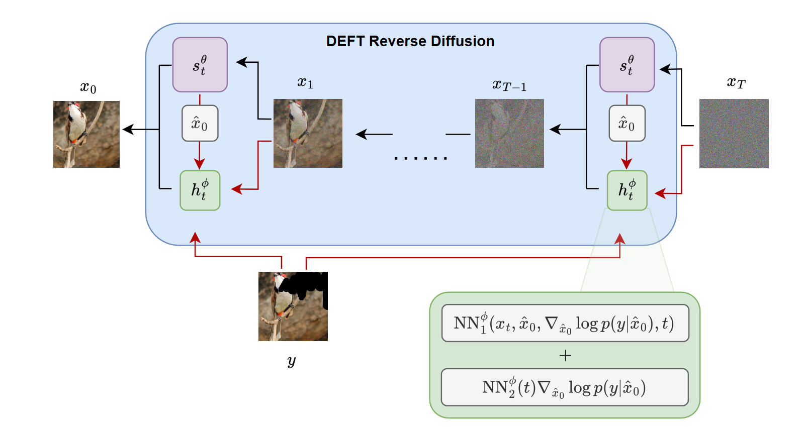

# [DEFT: Efficient Finetuning of Conditional Diffusion Models by Learning the Generalised h-transform](https://arxiv.org/pdf/2406.01781)

Alexander Denker*, Francisco Vargas*, Shreyas Padhy*, Kieran Didi*, Simon Mathis*, Vincent Dutordoir, Riccardo Barbano, Emile Mathieu, Urszula Julia Komorowska, Pietro Lio 

**This repository will contain the implementation of DEFT as a fork of RED-diff.**




### Abstract
Generative modelling paradigms based on denoising diffusion processes have emerged as a leading candidate for conditional sampling in inverse problems. In many real-world applications, we often have access to large, expensively trained unconditional diffusion models, which we aim to exploit for improving conditional sampling. Most recent approaches are motivated heuristically and lack a unifying framework, obscuring connections between them. Further, they often suffer from issues such as being very sensitive to hyperparameters, being expensive to train or needing access to weights hidden behind a closed API. In this work, we unify conditional training and sampling using the mathematically well-understood Doob’s h-transform. This new perspective allows us to unify many existing methods under a common umbrella. Under this framework, we propose DEFT (Doob’s h-transform Efficient FineTuning), a new approach for conditional generation that
simply fine-tunes a very small network to quickly learn the conditional h-transform, while keeping the larger unconditional network unchanged. DEFT is much faster
than existing baselines while achieving state-of-the-art performance across a variety of linear and non-linear benchmarks. On image reconstruction tasks, we achieve
speedups of up to 1.6x, while having the best perceptual quality on natural images and reconstruction performance on medical images.

## Getting Started

## Citation

If you find this work helpful please cite:

``` 
@article{denker2024deft,
  title={DEFT: Efficient Finetuning of Conditional Diffusion Models by Learning the Generalised $h$-transform},
  author={Denker, Alexander and Vargas, Francisco and Padhy, Shreyas and Didi, Kieran and Mathis, Simon and Dutordoir, Vincent and Barbano, Riccardo and Mathieu, Emile and Komorowska, Urszula Julia and Lio, Pietro},
  journal={arXiv preprint arXiv:2406.01781},
  year={2024}
}
```